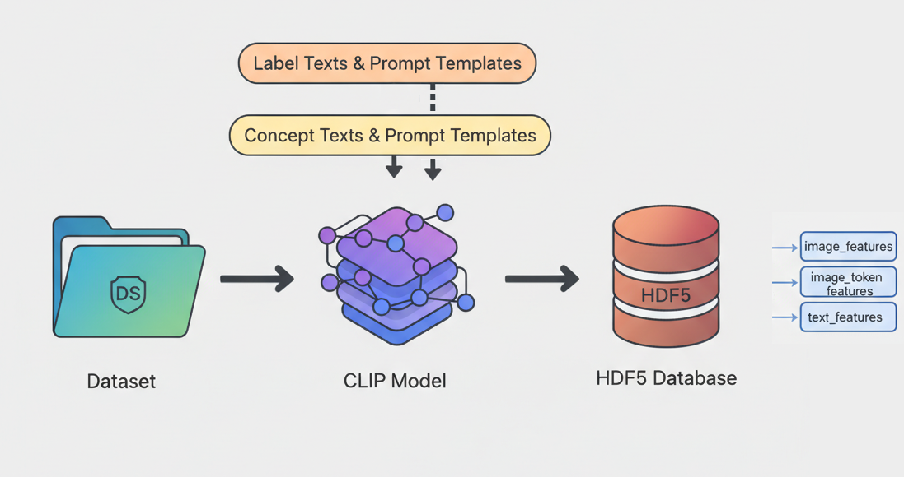

<div align="center">

# XAI_based_on_CLIP

基于 CLIP 的医学图像可解释特征库构建与访问工具集

</div>

## 目录

- [XAI\_based\_on\_CLIP](#xai_based_on_clip)
  - [目录](#目录)
  - [仓库功能概述](#仓库功能概述)
  - [安装与环境要求](#安装与环境要求)
  - [快速开始](#快速开始)
    - [方式 A：通过 Notebook（推荐初次使用）](#方式-a通过-notebook推荐初次使用)
    - [方式 B：通过命令行脚本](#方式-b通过命令行脚本)
  - [数据写入流程（Notebook1）](#数据写入流程notebook1)
  - [数据读取与访问（Notebook2）](#数据读取与访问notebook2)
  - [HDF5 特征库结构说明](#hdf5-特征库结构说明)
  - [PY文件模块说明](#py文件模块说明)
  - [命令行使用示例](#命令行使用示例)
  - [自定义数据集接入指南](#自定义数据集接入指南)
  - [常见问题 \& 优化建议](#常见问题--优化建议)
  - [致谢与引用](#致谢与引用)
  - [TODO](#todo)

---

## 仓库功能概述



该仓库用于基于 CLIP 系列模型（当前使用 `JerrryNie/ConceptCLIP`）对医学图像数据集进行：

- 文本概念与标签 Prompt 生成与编码（Text Encoder）
- 图像全局 CLS 与 patch Token 特征提取（Image Encoder）
- 特征统一存储到结构化的 HDF5 数据库 `conceptclip_features.h5`
- 提供便捷的读取、检索、子集访问与模板管理函数
- 支撑后续概念检索（concept retrieval）、可解释分类、提示工程实验、零样本对比/打分等下游任务

---

## 安装与环境要求

**1.基础环境**

建议 Python 3.10+ 与使用 GPU 推理。
作者测试环境：NVIDIA GeForce RTX 4060 Laptop GPU 8GB，Windows11

相关Python库：`torch`、`transformers`、`h5py`、`medmnist`等。

**2.HuggingFace访问**

示例模型：`JerrryNie/ConceptCLIP` 需要 Hugging Face Token：

```python
from huggingface_hub import login
login(token="<YOUR_HF_TOKEN>")
```

**3.额外说明**

- 数据集：示例使用 BloodMNIST（来自 `medmnist`）。首次运行会自动下载。
- 显存优化：图像特征写入使用 `float16`，文本保持 `float32` 以兼顾精度。

---

## 快速开始

### 方式 A：通过 Notebook（推荐初次使用）

1. 打开 `[Notebook1]Generate_concept_features.ipynb`，按章节顺序运行（文本 → 图像）。
2. 运行完成后生成 `conceptclip_features.h5`。
3. 打开 `[Notebook2]Access_Database.ipynb` 查看结构与读取示例。

### 方式 B：通过命令行脚本

使用仓库中的PY文件。假定你已经把仓库根目录加入工作路径。

```powershell
# 1. 登录 Hugging Face（首次）
python -c "from huggingface_hub import login; login(token='YOUR_HF_TOKEN')"

# 2. 运行特征写入主脚本（可选参数决定写哪些阶段）
python feature_store_main.py --run-text --run-image --h5 ./conceptclip_features.h5 --batch-size 64

# 3. 查看数据库概要
python database_access_main.py summarize --h5 ./conceptclip_features.h5

# 4. 示例：获取模板名称
python database_access_main.py templates --h5 ./conceptclip_features.h5
```

> 参数和子命令以代码实际实现为准，可在脚本内或使用 `-h` 查看帮助。

---

## 数据写入流程（Notebook1）

`[Notebook1]Generate_concept_features.ipynb` 中的写入逻辑可以拆解为 5 个关键阶段：

1. **准备数据集与 Prompt 元信息**：
   - 构造 `train_loader` / `val_loader` / `test_loader`（`batch_size=64`，`shuffle=False`，保证写入顺序）
   - 定义 `label_list`、`concept_list` 及各自Prompt模板
   - 封装为 `DB_METADATA` 写入根属性。
2. **初始化 / 恢复 H5**：`init_file()` 首次创建结构（主数据集 + `templates/` 组），写入 `D=1152`、`T_img=729` 等属性；再次运行自动补齐缺失字段，支持断点续写。
3. **写入文本模板特征**：
   - 组合模板与文本生成 `template_texts_map`；调用 `model.encode_text(input_ids, normalize=True)` 得到 CLS（即文本Embedding） 。
   - 若有 `model.text_proj` 执行投影，获得文本 token 特征。
   - 经 `write_template()` 写入子模板组，并记录 `texts_hash` 等相关参数。
4. **写入图像与 token 特征**：
   - 遍历三个Dataloader（train、val、test）划分，调用 `model.encode_image(pixel_values, normalize=True)`，获取图像Embedding和图像patch（27×27）的Embedding。
   - 若存在 `model.image_proj` 使用投影输出。
   - 通过 `split_counts` 与偏移逻辑跳过已写入部分，保持 `ids` 单调且与标签、划分对齐。
5. **验证**：`validate_h5()` 打印形状预览、`split_counts`、模板摘要与模型参数，帮助确认完整性。

中断恢复：只需重新执行相应单元，`split_counts` 会自动确保不重复写入；若要重建，可删除原文件或清空模板组后重跑。

---

## 数据读取与访问（Notebook2）

主要功能：

- `summarize_h5()`：展示HDF5数据库整体结构、样本计数、`split_counts`、模板概览。
- `_build_h5_tree()`：生成树形结构文本（含部分属性字段）。
- `clear_all_templates()`：安全清空 `templates/` 下所有模板并重建空组。
- `access_sample_by_index(idx)`：按全局索引读取单个样本（CLS + patch 特征 + 标签 + 划分）。
- `access_batch(split, idx, type)`：按数据划分和索引批量读取（`image` / `patches` / `label`）。
- `get_template_names()`：列出当前已写入的模板组。
- `fetch_template_features(...)`：按模板 ID / 类型（概念或标签）/ 概念子集 / 输出类别（CLS or tokens）获取特征。

更多示例详见 `[Notebook2]Access_Database.ipynb`。

---

## HDF5 特征库结构说明

字段、属性等更完整的数据库Documentation参见 `H5_Database_Documentation.md`。

顶层结构（示例）：

```
conceptclip_features.h5
├── image_features               # [N, 1152]
├── image_token_features         # [N, 729, 1152]
├── ids                          # [N] int64
├── labels                       # [N] int64
├── split                        # [N]
├── attrs: {D, T_img, created_at, version, split_counts,
│          logit_scale, logit_bias,
│          concept_logit_scale, concept_logit_bias,
│          label_texts, prompt_temp_for_labels,
│          concept_texts, prompt_temp_for_concepts, ...}
└── templates/
	├── concept_prompts_t01/
	│   ├── text_features        # [K_concept, 1152] (float32)
	│   ├── text_token_features  # [K_concept, T_txt, 1152] (float32, optional)
	│   ├── texts                # [K_concept]
	│   └── attrs: {K, D, T_txt, texts_hash, created_at, ...}
	├── ...
	└── label_prompts_t01/
		├── text_features        # [K_label, 1152] (float32)
		├── text_token_features  # [K_label, T_txt, 1152] (float32, optional)
		├── texts                # [K_label]
		└── attrs: {K, D, T_txt, texts_hash, created_at, ...}
```


---

## PY文件模块说明

使用前，请在环境变量中设置`HF_TOKEN`（Hugging Face Token），使`feature_store_main.py`能读取`os.getenv("HF_TOKEN")`。

| 模块 | 作用 | 关键函数 / 类 | 备注 |
| ---- | ---- | ------------- | ---- |
| `database_preparation.py` | 准备数据集与 DataLoader、构造 Prompt 列表与元信息 | `prepare_bloodmnist_artifacts`, `build_dataloaders`, `PromptConfig`, `DatasetBundle` | 建议 `shuffle=False` 保持 ID 顺序 |
| `model_deployment.py` | 加载 ConceptCLIP 模型与处理器并设置设备 | `load_conceptclip_model`, `resolve_device` | 支持 GPU/CPU 自动选择 |
| `feature_extraction.py` | 初始化 H5，写入文本与图像特征 | `init_feature_store`, `store_prompt_features`, `encode_and_store_image_features`, `run_full_pipeline` | 文本 `float32`、图像 `float16` |
| `database_access.py` | 读取/汇总/筛选模板与样本特征 | `summarize_h5`, `fetch_template_features`, `access_batch`, `clear_all_templates` | 与 Notebook2 功能对齐 |
| `feature_store_main.py` | CLI：执行文本/图像特征写入管线 | `main()` | 查看 `-h` 获取参数 |
| `database_access_main.py` | CLI：数据库查询与模板操作 | `main()` | 子命令：`summarize`, `sample`, `batch`, `templates`, `fetch`, `clear` |

---

## 命令行使用示例

```powershell
# 写入全部（文本 + 图像）
python feature_store_main.py --run-text --run-image --h5 ./conceptclip_features.h5 --batch-size 32

# 仅追加图像特征（假设文本模板已写入）
python feature_store_main.py --run-image --h5 ./conceptclip_features.h5 --batch-size 64

# 概览 & 模板
python database_access_main.py summarize --h5 ./conceptclip_features.h5
python database_access_main.py templates --h5 ./conceptclip_features.h5

# 访问一个样本（示意，具体参数以脚本实现为准）
python database_access_main.py sample --index 12000 --h5 ./conceptclip_features.h5

# 拉取某些模板的 CLS 特征
python database_access_main.py fetch --templates concept_prompts_t01 concept_prompts_t02 --type text --h5 ./conceptclip_features.h5
```

---

## 自定义数据集接入指南

1. 准备自定义 `torch.utils.data.Dataset`，其 `__getitem__` 返回 `(image_tensor, label)`；若无标签可返回 `0` 或占位值。
2. 确保图像张量为 `FloatTensor` 形状 `[C,H,W]` 且数值范围 `[0,1]`（若原始为 PIL / uint8，可用 `transforms.ToTensor()`）。
3. 构建 DataLoader（推荐 `shuffle=False`）。
4. 定义：
   - `label_list`: 每个类别的英文或描述文本
   - `concept_list`: 领域概念或细粒度特征词
   - 模板列表：`label_prompt_template_list` 与 `concept_prompt_template_list`（使用 `{}` 占位）
5. 调整 `D` / `T_img` 仅在使用不同模型时；否则保持与 ConceptCLIP 兼容。
6. 调用对应函数：`store_prompt_features()` → `encode_and_store_image_features()` 或使用 `run_full_pipeline()`。
7. 如需重新生成文本模板，使用 `clear_all_templates()` 清空后再写入。

---

## 常见问题 & 优化建议

| 问题 | 原因 | 解决方案 |
| ---- | ---- | -------- |
| 写入重复样本 | 中途重跑未跳过 | 确认 `split_counts` 正常；不要删除其属性；或完全删库重建 |
| 显存不足 | batch 太大 / 同时保留 token 特征 | 减小 `batch_size`；按需禁用 token 写入（修改代码） |
| 模板未更新 | 旧模板组仍存在 | 调用 `clear_all_templates()` 后再写入 |

性能提示：H5 使用 `lzf` 压缩与分块，批量写入更高效；尽量按划分顺序一次写完，减少频繁打开文件。

---

## 致谢与引用

- 本项目基于 [HuggingFace Transformers](https://huggingface.co/docs/transformers/en/index) 与 [ConceptCLIP 模型](https://huggingface.co/JerrryNie/ConceptCLIP)。
- 数据集来源：[MedMNIST](https://medmnist.com/)（BloodMNIST）。
- 若在研究中使用，请引用对应论文与模型发布页面。


## TODO

- 支持更多医学影像数据集（如 PathMNIST）
- 更多CLIP模型选项
- Downstream分析支持1（概念分数计算、图像Heatmap绘制等）
- Downstream分析支持2（可解释分类等用于XAI研究）

