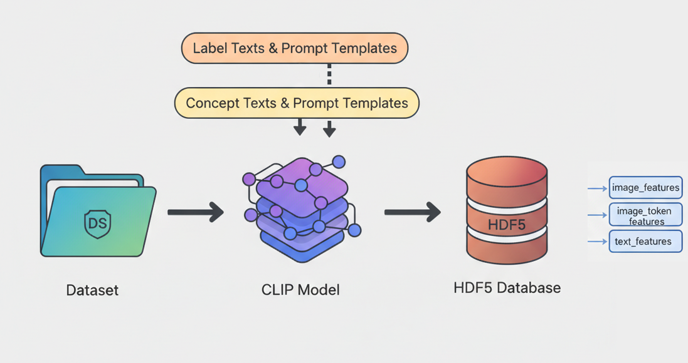

<div align="center">

# XAI_based_on_CLIP

An Explainable Medical Imaging Feature Store Powered by CLIP

Chinese Documentation See: [Documentaions_and_Notebooks_CHN](./Documentaions_and_Notebooks_CHN/)

</div>

## Table of Contents

- [XAI\_based\_on\_CLIP](#xai_based_on_clip)
	- [Table of Contents](#table-of-contents)
	- [Overview](#overview)
	- [Installation \& Environment](#installation--environment)
	- [Quick Start](#quick-start)
		- [Option A: Notebooks (Recommended First Run)](#option-a-notebooks-recommended-first-run)
		- [Option B: Command Line Scripts](#option-b-command-line-scripts)
	- [Data Writing Workflow (Notebook1)](#data-writing-workflow-notebook1)
	- [Data Reading \& Access (Notebook2)](#data-reading--access-notebook2)
	- [HDF5 Feature Store Structure](#hdf5-feature-store-structure)
	- [Python Module Overview](#python-module-overview)
	- [CLI Usage Examples](#cli-usage-examples)
	- [Custom Dataset Integration Guide](#custom-dataset-integration-guide)
	- [FAQ \& Optimization Tips](#faq--optimization-tips)
	- [Acknowledgements \& Citations](#acknowledgements--citations)
	- [TODO](#todo)

---

## Overview



This repository demonstrates how to leverage a CLIP family model (currently `JerrryNie/ConceptCLIP`) for medical image feature extraction, prompt–based concept encoding, and structured storage. It provides:

- Construction & encoding of concept / label prompts (Text Encoder)
- Extraction of global CLS and patch-level token features (Image Encoder)
- Unified persistence into an HDF5 feature store: `conceptclip_features.h5`
- Convenient feature access, filtering, template management utilities
- A foundation for concept retrieval, explainable classification, prompt engineering, zero-shot scoring, and other downstream XAI tasks

---

## Installation & Environment

**1. Base Environment**

Python 3.10+ is recommended. GPU acceleration is strongly advised for bulk image encoding.
Tested on: NVIDIA GeForce RTX 4060 Laptop GPU (8 GB), Windows 11.

Core Python libraries: `torch`, `transformers`, `h5py`, `medmnist`, etc.

**2. Hugging Face Access**

Model: `JerrryNie/ConceptCLIP` requires a Hugging Face token.

```python
from huggingface_hub import login
login(token="<YOUR_HF_TOKEN>")
```

**3. Additional Notes**

- Dataset: Uses BloodMNIST (`medmnist`). Auto-downloads on first run.
- Memory optimization: image features are stored in `float16`, text features in `float32` for precision.

---

## Quick Start

### Option A: Notebooks (Recommended First Run)

1. Open [`[Notebook1]Generate_concept_features.ipynb`](./[Notebook1]Generate_concept_features.ipynb) and run cells sequentially (Text → Image).
2. After completion, the file `conceptclip_features.h5` will be created.
3. Open [`[Notebook2]Access_Database.ipynb`](./[Notebook2]Access_Database.ipynb) to inspect structure and run access examples.

### Option B: Command Line Scripts

Assuming repository root is your working directory:

```powershell
# 1. Login to Hugging Face (first time)
python -c "from huggingface_hub import login; login(token='YOUR_HF_TOKEN')"

# 2. Run full pipeline (text + image)
python feature_store_main.py --run-text --run-image --h5 ./conceptclip_features.h5 --batch-size 64

# 3. Summarize database
python database_access_main.py summarize --h5 ./conceptclip_features.h5

# 4. List template names
python database_access_main.py templates --h5 ./conceptclip_features.h5
```

> Use `-h` with any script to view detailed argument help.

---

## Data Writing Workflow (Notebook1)

`[Notebook1]Generate_concept_features.ipynb` breaks the pipeline into five key stages:

1. **Prepare Dataset & Prompt Metadata**  
	- Build `train_loader` / `val_loader` / `test_loader` (`batch_size=64`, `shuffle=False` to preserve order)  
	- Define `label_list`, `concept_list`, and their prompt templates  
	- Pack them into `DB_METADATA` (stored as root attributes)
2. **Initialize / Resume H5**  
	- `init_file()` creates datasets + `templates/` group with attributes (`D=1152`, `T_img=729`) on first run  
	- Subsequent runs reuse structure and fill any missing datasets (checkpoint-friendly)
3. **Write Text Template Features**  
	- Combine templates with texts -> `template_texts_map`  
	- Encode via `model.encode_text(input_ids, normalize=True)` to obtain CLS embeddings (and token features if `model.text_proj` exists)  
	- Store with `write_template()`, record `texts_hash` and logit parameters
4. **Write Image & Token Features**  
	- Iterate splits, call `model.encode_image(pixel_values, normalize=True)`  
	- Use projected tokens if `model.image_proj` is available  
	- Track progress with `split_counts` and offset logic to skip already-written samples, ensuring monotonic `ids` aligned with labels & splits
5. **Validate**  
	- `validate_h5()` prints shapes, `split_counts`, template summary, stored model parameters

Interrupted run? Simply rerun the relevant cells—`split_counts` prevents duplicate entries. To rebuild from scratch, delete the file or clear templates and regenerate.

---

## Data Reading & Access (Notebook2)

Key utilities:

- `summarize_h5()` – structural overview, sample counts, `split_counts`, template list.
- `_build_h5_tree()` – textual tree with selected attributes.
- `clear_all_templates()` – safely remove all template groups; recreates empty `templates/`.
- `access_sample_by_index(idx)` – retrieve single sample (CLS + patch tokens + label + split).
- `access_batch(split, idx, type)` – batch retrieval (`image` / `patches` / `label`).
- `get_template_names()` – list all stored template group IDs.
- `fetch_template_features(...)` – flexible retrieval by template ID, concept/label prefix, concept subset, feature type (CLS vs tokens).

See `[Notebook2]Access_Database.ipynb` for runnable examples.

---

## HDF5 Feature Store Structure

For full attribute/dataset explanations, refer to `Documentaions_ENG/H5_Database_Documentation.md`.

Top-level layout (example):

```
conceptclip_features.h5
├── image_features               # [N, 1152]
├── image_token_features         # [N, 729, 1152]
├── ids                          # [N] int64
├── labels                       # [N] int64
├── split                        # [N]
├── attrs: {D, T_img, created_at, version, split_counts,
│          logit_scale, logit_bias,
│          concept_logit_scale, concept_logit_bias,
│          label_texts, prompt_temp_for_labels,
│          concept_texts, prompt_temp_for_concepts, ...}
└── templates/
	 ├── concept_prompts_t01/
	 │   ├── text_features        # [K_concept, 1152] (float32)
	 │   ├── text_token_features  # [K_concept, T_txt, 1152] (float32, optional)
	 │   ├── texts                # [K_concept]
	 │   └── attrs: {K, D, T_txt, texts_hash, created_at, ...}
	 ├── ...
	 └── label_prompts_t01/
		  ├── text_features        # [K_label, 1152] (float32)
		  ├── text_token_features  # [K_label, T_txt, 1152] (float32, optional)
		  ├── texts                # [K_label]
		  └── attrs: {K, D, T_txt, texts_hash, created_at, ...}
```

---

## Python Module Overview

Before use, set the `HF_TOKEN` environment variable (Hugging Face Token) so that `feature_store_main.py` can read `os.getenv("HF_TOKEN")`.

| Module | Purpose | Key Functions / Classes | Notes |
| ------ | ------- | ----------------------- | ----- |
| `database_preparation.py` | Prepare dataset & DataLoaders; build prompt lists & metadata | `prepare_bloodmnist_artifacts`, `build_dataloaders`, `PromptConfig`, `DatasetBundle` | Use `shuffle=False` to maintain ID order |
| `model_deployment.py` | Load ConceptCLIP & processor, set device | `load_conceptclip_model`, `resolve_device` | Auto GPU/CPU selection |
| `feature_extraction.py` | Initialize H5, write text & image features | `init_feature_store`, `store_prompt_features`, `encode_and_store_image_features`, `run_full_pipeline` | Text `float32`, image `float16` |
| `database_access.py` | Read / summarize / filter templates & samples | `summarize_h5`, `fetch_template_features`, `access_batch`, `clear_all_templates` | Mirrors Notebook2 utilities |
| `feature_store_main.py` | CLI: execute text / image feature pipeline | `main()` | Use `-h` for args |
| `database_access_main.py` | CLI: query & manage database/templates | `main()` | Subcommands: `summarize`, `sample`, `batch`, `templates`, `fetch`, `clear` |

---

## CLI Usage Examples

```powershell
# Full (text + image) pipeline
python feature_store_main.py --run-text --run-image --h5 ./conceptclip_features.h5 --batch-size 32

# Append image features only (text templates already stored)
python feature_store_main.py --run-image --h5 ./conceptclip_features.h5 --batch-size 64

# Overview & template listing
python database_access_main.py summarize --h5 ./conceptclip_features.h5
python database_access_main.py templates --h5 ./conceptclip_features.h5

# Fetch a single sample (example index)
python database_access_main.py sample --index 12000 --h5 ./conceptclip_features.h5

# Fetch CLS features from specific templates
python database_access_main.py fetch --templates concept_prompts_t01 concept_prompts_t02 --type text --h5 ./conceptclip_features.h5
```

---

## Custom Dataset Integration Guide

1. Implement a custom `torch.utils.data.Dataset` returning `(image_tensor, label)`. If labels are absent, return a placeholder (e.g. `0`).
2. Ensure images are `FloatTensor` `[C,H,W]` in range `[0,1]` (use `transforms.ToTensor()` if starting from PIL / uint8).
3. Build DataLoader(s) with `shuffle=False` to preserve insertion order.
4. Define:
	- `label_list`: human-readable category strings
	- `concept_list`: domain concepts / fine-grained attributes
	- prompt template lists: `label_prompt_template_list`, `concept_prompt_template_list` (use `{}` placeholder)
5. Adjust `D` / `T_img` only if using a different backbone model; otherwise keep ConceptCLIP defaults.
6. Call `store_prompt_features()` then `encode_and_store_image_features()` (or `run_full_pipeline()`).
7. To regenerate text templates, run `clear_all_templates()` before re-writing.

---

## FAQ & Optimization Tips

| Issue | Cause | Resolution |
| ----- | ----- | ---------- |
| Duplicate samples | Re-running without respecting `split_counts` | Keep `split_counts`; delete file only if full rebuild needed |
| OOM / insufficient VRAM | Batch size too large / storing token features | Reduce `--batch-size`; optionally skip token storage (modify code) |
| Template not updating | Old template group persists | Run `clear_all_templates()` then rewrite |
| Slow reads | Reading entire `image_token_features` | Slice selectively or use CLS features first |

Performance hint: H5 uses `lzf` compression + chunking; write in contiguous batches per split to minimize fragmentation.

---

## Acknowledgements & Citations

- Built with [Hugging Face Transformers](https://huggingface.co/docs/transformers/en/index) and the [ConceptCLIP model](https://huggingface.co/JerrryNie/ConceptCLIP).
- Dataset: [MedMNIST / BloodMNIST](https://medmnist.com/).
- Please cite the relevant papers / model pages if you use this repository in research.

---

## TODO

- Support additional medical image datasets (e.g. PathMNIST)
- More CLIP backbone options
- Downstream analysis set 1 (concept scoring, image heatmap generation)
- Downstream analysis set 2 (explainable classification pipelines)

Contributions & Issues are welcome 🎯

